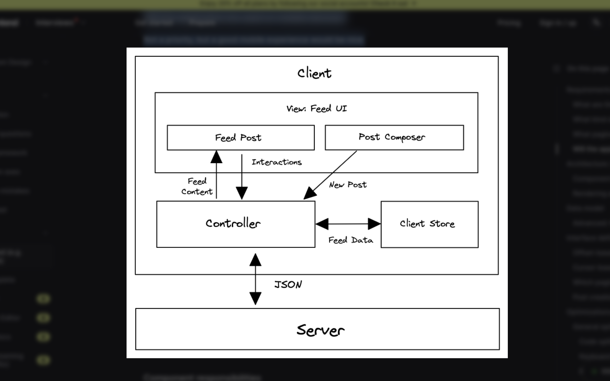

Facebook News Feed Implementation

1. Core Features
   Browse news feed containing posts by the user and their friends.
   Liking and reacting to feed posts.
   Creating and publishing new posts.
   Commenting and sharing posts

2. Types of Post supported should be Text and Image based posts

3. What pagination UX should be used for the feed?
   Infinite scrolling, meaning more posts will be added when the user reaches the end of their feed.

4. Will the application be used on mobile devices?  
   Not a priority, but a good mobile experience would be nice.

   
